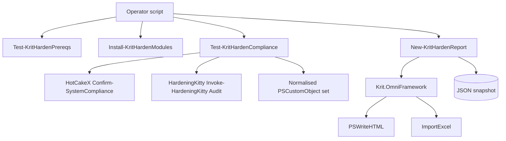

# Krit.Hardening — Architecture

Author: Joshua Finley — Kritical Pty Ltd

## Shape

## Layers

| Layer | Files | Role |
| --- | --- | --- |
| Public | `src/Public/*.ps1` | 5 operator entry points. Comment-based help. Banner-emitting. |
| Private | `src/Private/_Banner.ps1` | Banner reader that defers to Krit.OmniFramework when present. |
| Manifest | `src/Krit.Hardening.psd1` | Author=Joshua Finley. RequiredModules pins Krit.OmniFramework ≥ 1.0.1. |
| Assets | `src/Assets/kritical-logo.txt` | Bundled brand banner fallback. |
| Tests | `tests/Unit/` | 16 Pester unit tests (Banner / Manifest / Modules / Prereqs / Report). |

## Design choices

- **Audit-only in v1.0.0** — destructive `Invoke-KritHardenApply` is intentionally deferred to v1.1.0 until the snapshot+rollback pipeline is bulletproof. Customers can publish-graduate from v1.0.0 → v1.1.0 with one `Update-Module` call.
- **Stand on giants** — every audit probe is the genuine OSS tool (HotCakeX / HardeningKitty / DSC family); the Kritical value is orchestration + normalisation + reporting + brand discipline.
- **Per-probe timeout via PowerShell Job** — a hung tool can't lock up the whole compliance pass.
- **Findings normalisation** — every source emits its own shape; we collapse into one PSCustomObject schema `(Source, Category, Control, Outcome, Detail, Recommendation, Severity)` so dashboards / SIEM ingest one shape regardless of origin.
- **OmniFramework dependency optional at runtime** — `New-KritHardenReport` falls back to JSON-only if OmniFramework isn't loaded (CI scenario), but the manifest declares it as required for the supported install path.
- **Brand-anti-leak enforced by test** — `Manifest.Tests.ps1` scans every published source for `Claude/Hermes/Codex/Copilot/ChatGPT/Anthropic/OpenAI` strings. Blocks the publish if any leak.

## Adding a new public function

1. Drop a file in `src/Public/<Verb-KritHarden*>.ps1` with comment-based help + `.NOTES Author: Joshua Finley - Kritical Pty Ltd`.
2. Add the function name to `FunctionsToExport` in `Krit.Hardening.psd1`.
3. Add a Pester test in `tests/Unit/`.
4. Update `README.md` "Exported functions" table + `docs/USAGE.md`.
5. Run `tests\Invoke-AllTests.ps1` until green.
6. Bump version, add `ReleaseNotes`, publish via `tools/Publish-KritHardening.ps1`.

## Version roadmap

- **1.0.0** (this) — audit-only; HotCakeX + HardeningKitty + DSC inventory + branded HTML+Excel+JSON reports
- **1.1.0** (planned) — destructive apply path: `Invoke-KritHardenApply -Area Defender|Firewall|BitLocker|...` with snapshot/rollback
- **1.2.0** (planned) — `Start-KritHardenWatcher` scheduled task; drift detection + alerting
- **2.0.0** (planned) — Linux + macOS audit path via `Get-KritPlatform` branching to lynis / openscap-scanner / debsecan / oscap on *nix
